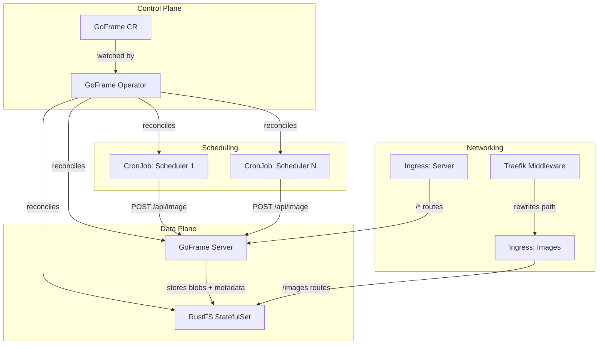
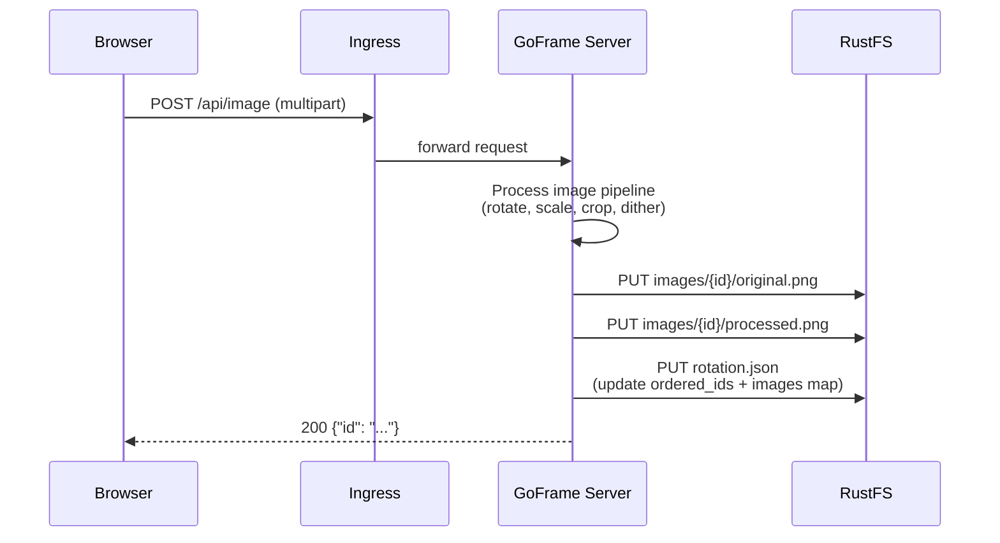
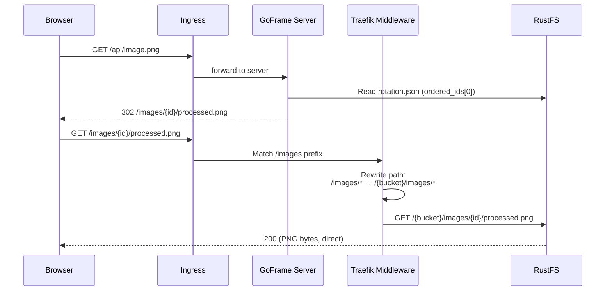
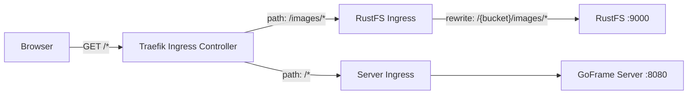
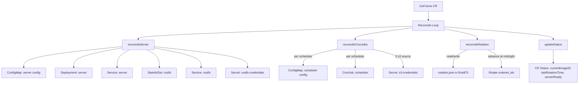
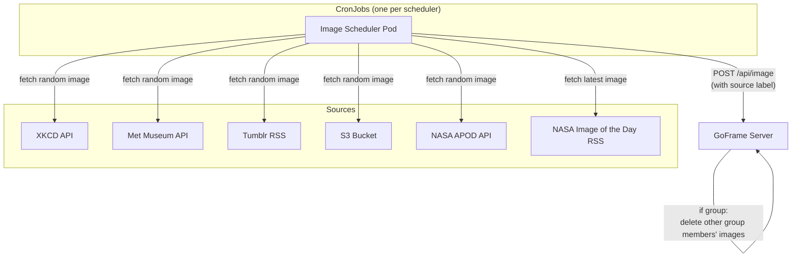

# GoFrame Kubernetes Architecture

## Overview

GoFrame is a Kubernetes-native image rotation system. A custom operator manages the lifecycle of all components: a stateless web server, S3-compatible storage (RustFS), and CronJob-based image schedulers.



---

## Component Details

| Component | Kind | Port | Purpose |
|-----------|------|------|---------|
| GoFrame Operator | Deployment | 8082/8083 | Reconciles GoFrame CRs |
| GoFrame Server | Deployment | 8080 | Web UI, API, image processing |
| RustFS | StatefulSet | 9000 | S3-compatible blob + metadata storage |
| Image Schedulers | CronJob (one per source) | - | Fetch images from external sources |
| Server Ingress | Ingress | 80/443 | Routes UI/API traffic |
| RustFS Ingress | Ingress + Middleware | 80/443 | Direct browser access to images |

---

## Data Flow: Image Upload



---

## Data Flow: Image Display



---

## Ingress Routing



The RustFS ingress uses a Traefik `replacePathRegex` Middleware to rewrite `/images/(.*)` to `/{bucket}/images/$1`, mapping the browser-facing URL to the S3 object key.

A bucket policy grants anonymous `s3:GetObject` on `images/*`, so no authentication is required for image fetches through the ingress.

---

## Operator Reconciliation



---

## Storage: rotation.json

All state is stored in RustFS as `rotation.json`. The server is stateless — no PVC or local database is required.

```json
{
  "last_rotated": "2026-05-31T00:00:00Z",
  "ordered_ids": ["id-b", "id-a"],
  "images": {
    "id-a": { "created_at": "2026-05-30T10:00:00Z", "source": "xkcd" },
    "id-b": { "created_at": "2026-05-31T09:00:00Z", "source": "" }
  }
}
```

- `ordered_ids`: display order; index 0 is today's image
- `images`: per-image metadata (creation time, source label)
- `last_rotated`: timestamp of the last midnight rotation by the operator

Both the server and operator read and write this file. The server owns all image CRUD writes; the operator advances `ordered_ids` and updates `last_rotated` at midnight.

---

## Scheduler Architecture



Each scheduler is configured with:
- **cron**: When to run (timezone-aware)
- **source**: Which image source to use (`xkcd`, `oatmeal`, `metmuseum`, `tumblr`, `s3`, `nasaapod`, `nasaimageoftheday`)
- **group**: Mutually exclusive scheduling (e.g., weekday vs weekend)
- **onExternalImages**: Policy for non-group images (`ignore`, `takeover`, `yield`)
- **commands**: Optional per-scheduler image processing pipeline

### NASA sources

| Source | Fetch behaviour | Config |
|---|---|---|
| `nasaapod` | Picks a random entry from the full APOD archive via `api.nasa.gov` | Optional `apiKeySecretRef` for a production API key |
| `nasaimageoftheday` | Fetches the latest image from the NASA RSS feed (`nasa.gov/feed/`) | No additional configuration required |

---

## Rotation Logic

The operator performs timezone-aware midnight rotation:

1. Read `rotation.json` from RustFS (`ordered_ids`, `last_rotated`)
2. Compare current day (in configured timezone) to `last_rotated` day
3. If new day: rotate `ordered_ids` by number of elapsed days
4. Write updated `ordered_ids` and `last_rotated` back to `rotation.json`
5. Requeue reconciliation for next midnight

The server reads `rotation.json` on each request and serves `ordered_ids[0]` as the current image, ensuring operator and server stay in sync without direct communication.
