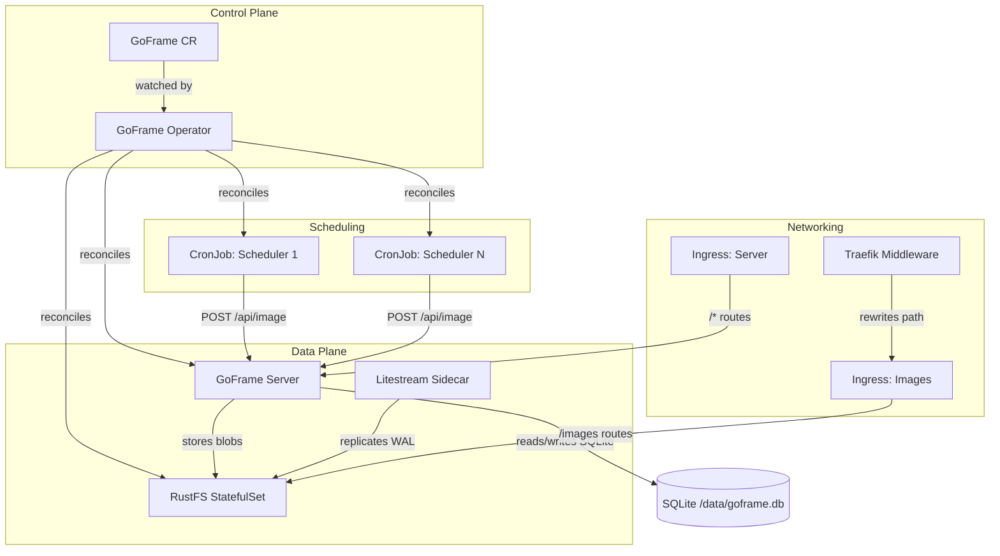
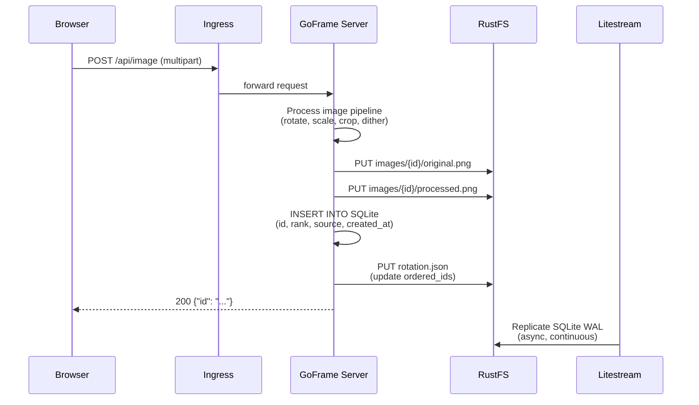
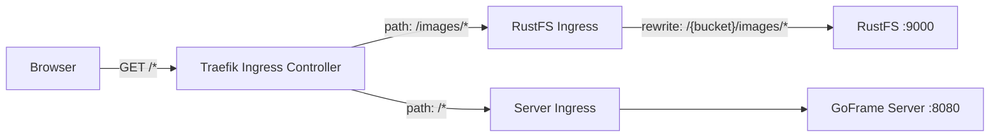
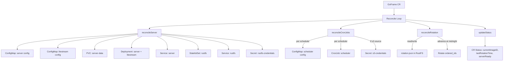
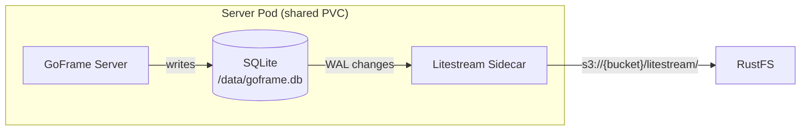
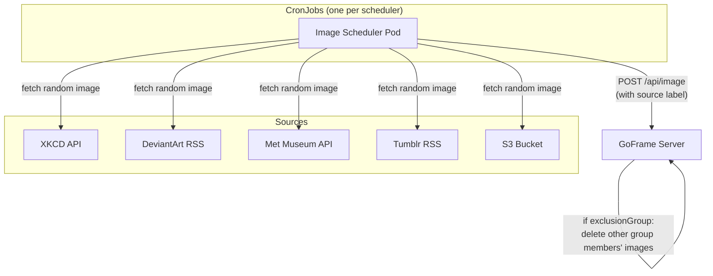

# GoFrame Kubernetes Architecture

## Overview

GoFrame is a Kubernetes-native image rotation system. A custom operator manages the lifecycle of all components: a web server, S3-compatible storage (RustFS), SQLite with WAL replication (Litestream), and CronJob-based image schedulers.

---

## Component Details

| Component | Kind | Port | Purpose |
|-----------|------|------|---------|
| GoFrame Operator | Deployment | 8082/8083 | Reconciles GoFrame CRs |
| GoFrame Server | Deployment (2 containers) | 8080 | Web UI, API, image processing |
| Litestream | Sidecar in Server Pod | - | SQLite WAL replication to RustFS |
| RustFS | StatefulSet | 9000 | S3-compatible blob storage |
| Image Schedulers | CronJob (one per source) | - | Fetch images from external sources |
| Server Ingress | Ingress | 80/443 | Routes UI/API traffic |
| RustFS Ingress | Ingress + Middleware | 80/443 | Direct browser access to images |

---

## Data Flow: Image Upload

---

## Data Flow: Image Display

---

## Ingress Routing

The RustFS ingress uses a Traefik `replacePathRegex` Middleware to rewrite `/images/(.*)` to `/{bucket}/images/$1`, mapping the browser-facing URL to the S3 object key.

A bucket policy grants anonymous `s3:GetObject` on `images/*`, so no authentication is required for image fetches through the ingress.

---

## Operator Reconciliation

---

## Litestream Replication

SQLite runs in WAL mode (`PRAGMA journal_mode=WAL`) for Litestream compatibility. The sidecar continuously monitors WAL changes and replicates snapshots to RustFS. On pod restart, Litestream can restore the database from the latest snapshot.

---

## Scheduler Architecture

Each scheduler is configured with:
- **cron**: When to run (timezone-aware)
- **source**: Which image source to use
- **keepCount**: Maximum images to retain from this source
- **exclusionGroup**: Mutually exclusive scheduling (e.g., weekday vs weekend)
- **commands**: Optional per-scheduler image processing pipeline

---

## Rotation Logic

The operator performs timezone-aware midnight rotation:

1. Read `rotation.json` from RustFS (`ordered_ids`, `current_id`, `last_rotated`)
2. Compare current day (in configured timezone) to `last_rotated` day
3. If new day: rotate `ordered_ids` by number of elapsed days
4. Write updated state back to `rotation.json`
5. Requeue reconciliation for next midnight

The server reads `rotation.json` on each request to determine which image to display, ensuring operator and server stay in sync without direct communication.
