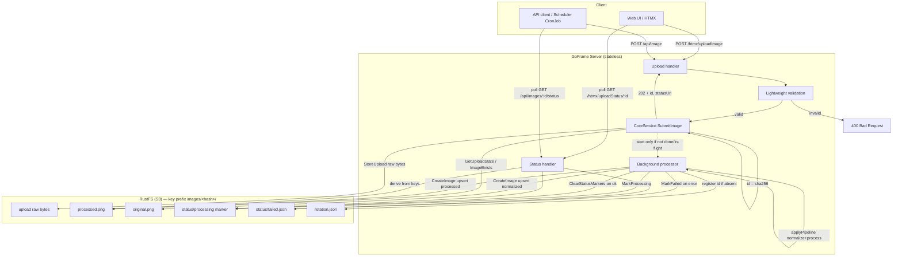
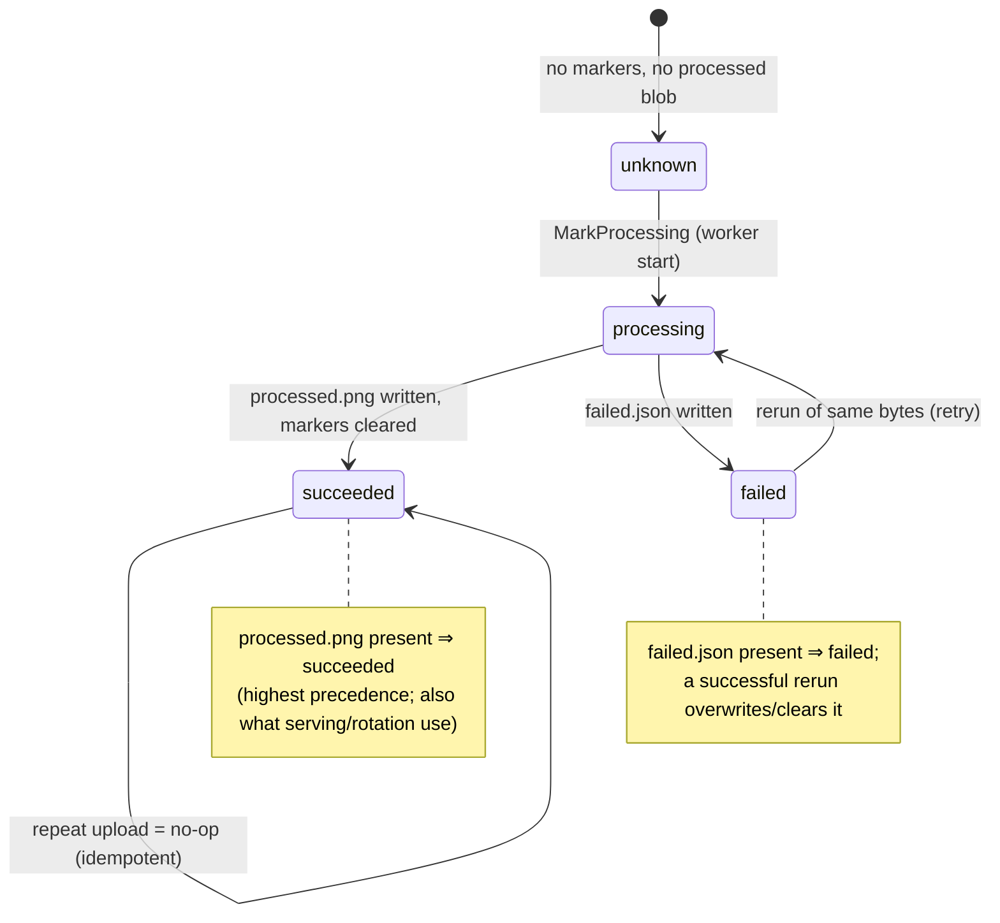

# Async Image Upload Architecture

## Overview

Image upload is **asynchronous and idempotent**, with **no separate job store**. A client `POST`s
image bytes; the server runs **lightweight validation** synchronously, **persists the raw uploaded
bytes** (`images/<hash>/upload`) so the accepted upload is durable, then returns `202 Accepted`
immediately while the expensive pipeline (orientation normalization, PNG conversion, configured
commands) and the normalized/processed blob writes run in the **background**. Clients observe
progress by polling a status endpoint.

Identity and idempotency are **content-addressed**: the image ID *is* the **SHA-256 hex of the
uploaded bytes**. Identical content ⇒ identical `images/<hash>/` key prefix ⇒ the same image. Any
replica, and even the client, can re-derive the ID, so re-uploading the same bytes is a natural
no-op.

Status is **derived by probing deterministic keys**, not stored — there is no `jobs.json` and no
status field on the rotation record. This is dictated by the storage client, which exposes only
`GetObject`/`PutObject`/`DeleteObject` (no `ListObjects`, no conditional PUT): every key we need to
GET is computable from the content hash alone.



---

## Upload sequence

```mermaid
sequenceDiagram
    autonumber
    participant C as Client
    participant S as Server (handler)
    participant V as Validation
    participant K as RustFS (images/&lt;hash&gt;/)
    participant W as Background worker

    C->>S: POST image bytes
    S->>V: validate (size, magic bytes, DecodeConfig)
    alt invalid
        V-->>S: typed validation error
        S-->>C: 400 Bad Request
    else valid
        V-->>S: ok
        S->>S: id = sha256(bytes)
        S->>K: GetUploadState(id)
        alt already succeeded (idempotent)
            K-->>S: processed.png exists
            S-->>C: 200 + {id, status: succeeded, statusUrl}
        else already processing
            K-->>S: processing marker present
            S-->>C: 202 + {id, status: processing, statusUrl}
        else not started
            K-->>S: unknown
            S->>K: MarkProcessing(id)
            S->>K: StoreUpload(id, raw bytes)  [synchronous, durable before 202]
            S-->>C: 202 Accepted + {id, status: processing, statusUrl}
            S->>W: spawn processImage(id, bytes)  [context.Background + timeout]
            W->>W: applyPipeline(bytes)  [normalize orientation + convert PNG + commands]
            alt success
                W->>K: CreateImage(id, original=normalized, processed) [upsert rotation]
                W->>K: ClearStatusMarkers(id)
            else failure
                W->>K: MarkFailed(id, error)
            end
        end
    end

    loop until terminal
        C->>S: GET status (id)
        S->>K: GetUploadState(id)
        K-->>S: derived status
        S-->>C: unknown | processing | succeeded | failed(+error)
    end
```

---

## Derived status state machine

Status is a **pure function of which keys exist** under `images/<hash>/` (checked in precedence
order), never a stored value:



Precedence in `GetUploadState` (≤4 GETs, no listing):
1. `processed.png` exists → **succeeded**
2. else `status/failed.json` exists → **failed** (error read from the object)
3. else `status/processing` marker exists → **processing**
4. else → **unknown**

> The raw `images/<hash>/upload` blob is **not** a status signal — it is written synchronously
> before `202` purely for durability, and `GetUploadState`/`ImageExists` ignore it.

---

## Blob layout (three blobs per image)

| Key | Written | Content | Purpose |
|-----|---------|---------|---------|
| `images/<hash>/upload` | **synchronously, before `202`** (`StoreUpload`) | raw uploaded bytes (`application/octet-stream`) | durability — an accepted upload survives a crash before processing |
| `images/<hash>/original.png` | background (`CreateImage`) | orientation-**normalized**, PNG-converted | served "original" variant |
| `images/<hash>/processed.png` | background (`CreateImage`) | fully processed (normalized + configured commands) | served "processed" variant; its presence ⇒ **succeeded** |

`original.png` is the *normalized* image, not the raw upload. `DeleteImage` removes all three blobs.

---

## Idempotency & identity (store-free)

| Concern | Design |
|---------|--------|
| Image ID | `sha256hex(originalBytes)` — deterministic, client re-derivable, validated `^[a-f0-9]{64}$` before use as a key |
| Dedupe | Same bytes ⇒ same ID ⇒ same key prefix; submit returns early if `succeeded`/`processing` (before any write) |
| Durability | Raw upload persisted synchronously (`StoreUpload` → `images/<hash>/upload`) before `202`, so an accepted upload survives a crash before processing |
| No duplicate rows | `CreateImage` upserts: registers the ID in `rotation.json` only if absent (safe on rerun) |
| Status source | Derived from `processed.png` + `status/processing` + `status/failed.json` keys |
| Multi-replica | All state is in RustFS keys computable from the hash — any replica answers a status poll |
| Cleanup | Markers cleared on success; a failed marker is overwritten by a successful rerun. No TTL/pruning needed (no job store) |

`UploadState` returned to callers: `{ id, status, error? }` where `status` is the typed
`UploadStatus` enum (`unknown` | `processing` | `succeeded` | `failed`).

---

## Validation (synchronous, before 202)

Cheap, in-memory checks only — the full pipeline stays in the background:

- non-empty and under `MaxUploadBytes` (config, default 25 MiB; also enforced by Echo `middleware.BodyLimit`);
- recognized raster format via standard-library registered decoders (`image.DecodeConfig`) — confirms a real image and yields dimensions without decoding the whole file; PNG signature reuse from `hasCorrectPngSignature`;
- SVG accepted as a candidate (full parse happens in the background pipeline).

A failed check returns a typed error mapped to `400 Bad Request`, so gross problems surface
immediately while genuine processing errors surface later via the derived status.

---

## Endpoints

| Method | Path | Purpose | Response |
|--------|------|---------|----------|
| POST | `/api/image` | Submit image (JSON API) | `202` (new/processing) or `200` (already succeeded) `{ id, status, statusUrl }` + `Location`; `400` on invalid |
| GET | `/api/images/:id/status` | Poll derived status (JSON API) | `200` typed `UploadState` |
| POST | `/htmx/uploadImage` | Submit image (UI) | HTML fragment "processing…" that self-polls |
| GET | `/htmx/uploadStatus/:id` | Poll derived status (UI) | HTML fragment; stops polling + OOB image-list swap on success |

`id` is the content hash and is also the image ID (`/api/images/:id/processed.png`, etc.), so no
separate job identifier is exposed. The UI fragment polls with `hx-trigger="load, every 2s"` and
drops the trigger on a terminal state — "success as soon as accepted, later errors still surfaced".

---

## Component changes (implementation map)

| Layer | File(s) | Change |
|-------|---------|--------|
| Validation | `internal/imagevalidation` (new) | Typed lightweight validator |
| Content-addressed status | `internal/database/uploadstatus.go` (new), `databaseservice.go`, `rustfs.go`, `fake.go` | `UploadStatus`/`UploadState`, `ImageExists`, `GetUploadState`, `StoreUpload` (raw `upload` blob), marker helpers; `CreateImage` takes the hash ID + rotation upsert |
| Orchestration | `internal/core/coreservice.go` | `SubmitImage`, background `processImage`, `GetUploadState` |
| JSON API | `internal/apihandler/apihandler.go` | `202`/`200` submit + `:id/status` route; shared multipart-read helper |
| UI | `internal/frontend/frontendservice.go`, `views/index.html` | Async submit fragment + polling status fragment |
| Scheduler | `internal/scheduler/scheduler.go` | Accept `202`/`200` from `/api/image` |
| Config | `config.ServiceConfig`, `local.example.yaml` | `MaxUploadBytes` |
| K8s hardening | `internal/operator/controller/reconciler_server.go`, `api/v1alpha1/goframe_types.go`, `charts/goframe/{templates/goframe-cr.yaml,values.yaml}` | Server pod resources, `/probe` liveness/readiness/startup probes, pod+container securityContext, configurable replicas, RollingUpdate strategy |

The Kubernetes best-practices hardening of the **server pod** (resources, probes, securityContext,
configurable replicas, rollout strategy) is implemented in the operator
(`internal/operator/controller/reconciler_server.go`) rather than a chart template, because the
server Deployment is built by the operator. New CR fields (`spec.server.replicas`,
`spec.server.resources`) are exposed through `values.yaml` and the generated CRD.

---

## End-to-end k3d verification

Run after implementation, using the project's existing k3d workflow (`Makefile`):

```bash
make start-k3d        # create cluster, build+push server/scheduler/operator images,
                      # install operator + GoFrame CR + chart (k3d/values.k3d.yaml)
```

Then exercise the async flow against the deployed server (via its ingress / port-forward):

1. **Async accept** — `POST /api/image` with a valid image → assert `202` and an `id` + `statusUrl`.
2. **Progress** — poll `GET /api/images/:id/status` → observe `processing` then `succeeded`.
3. **Image served** — the resulting image appears in `GET /api/images` and is retrievable.
4. **Idempotency** — re-`POST` the identical bytes → same `id`, `200`, exactly one image in the list.
5. **Validation** — `POST` garbage bytes → `400`, no image created.
6. **k8s hardening** (if bundled) — `kubectl get deploy <server> -o yaml` shows resources, `/probe` liveness/readiness probes, and the hardened securityContext; pod is `Running` and `Ready`.

```bash
make stop-k3d         # tear down the cluster
```

This can be scripted as an integration test reusing `test/integration` helpers (pointed at the
k3d server URL), so it runs both locally (`make start-docker` + `go run`) and against k3d.
